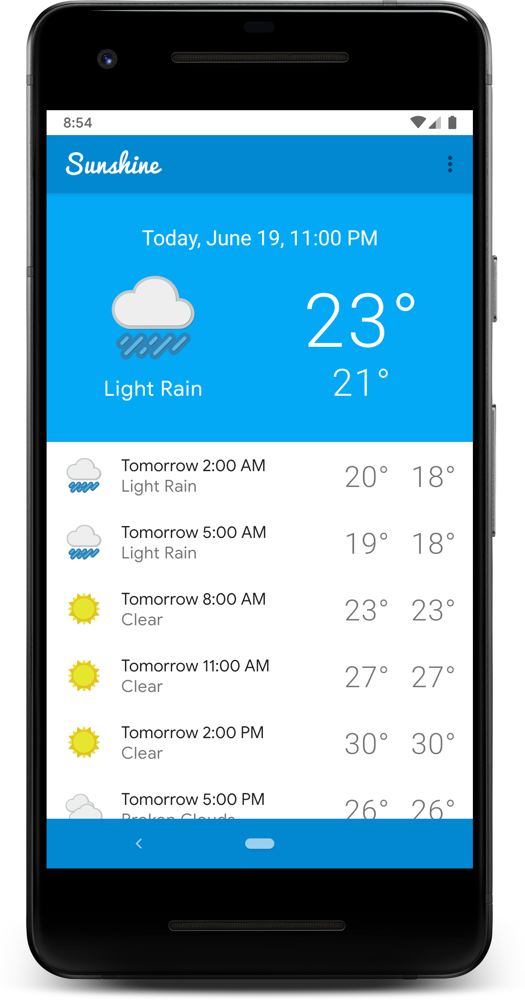

 
 

# Sunshine Clean Architecture Example

Sunshine is a work-in-progress weather app based on Udacity's course project. 

The main purpose of this project is to master clean architecture approaches and testing. It is still in its really __EARLY stages of development__  and currently contains only one piece of UI.

## Languages, libraries and tools used

* [Kotlin](https://kotlinlang.org/)
* [Room](https://developer.android.com/topic/libraries/architecture/room.html)
* [Android Architecture Components](https://developer.android.com/topic/libraries/architecture/index.html)
* [AndroidX Support Libraries](https://developer.android.com/jetpack/androidx)
* [Material Components for Android](https://github.com/material-components/material-components-android)
* [RxJava2](https://github.com/ReactiveX/RxJava/wiki/What's-different-in-2.0)
* [Dagger2](https://github.com/google/dagger)
* [Glide](https://github.com/bumptech/glide)
* [Retrofit](http://square.github.io/retrofit/)
* [OkHttp](http://square.github.io/okhttp/)
* [Gson](https://github.com/google/gson)
* [Timber](https://github.com/JakeWharton/timber)
* [KtLint](https://ktlint.github.io/)
* [Detekt](https://arturbosch.github.io/detekt/)
* [Mockito](http://site.mockito.org/)
* [Espresso](https://developer.android.com/training/testing/espresso/index.html)
* [Robolectric](http://robolectric.org/)

## Requirements

* JDK 1.8
* [Android SDK](https://developer.android.com/studio/index.html)
* Android O ([API 26](https://developer.android.com/preview/api-overview.html))
* Latest Android SDK Tools and build tools.

## Architecture

The architecture of `Sunshine` project follows the principles of Clean Architecture. Here's how the sample project implements it:

The sample app when run will show you a simple list of all the forecasts (check `ForecastView` for implementation details).

The diagram below presents how each of the architecture layers play their roles in this project:

## Credits

This project wouldn't be created if some repositories weren't created before

- https://github.com/googlesamples/android-architecture (Encyclopedia of architecture patterns and battle-tested techniques on Android)

- https://github.com/android10/Android-CleanArchitecture (the simplest way to implement clean architecture on Android)

- https://github.com/bufferapp/android-clean-architecture-boilerplate (this project is based on it)
